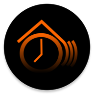

  

# HomeAutomationAlarmSender
Home Automation Alarm sender for android alarm to [openHAB](https://openhab.org) sync

This app let's you sync your next android alarm to your openHAB server. It sends the alarm time as seconds since 01/01/1970 as status update to the specified openHAB item.

- Install the **openHAB REST API** plugin
- Install **HomeAutomationAlarmSender** from any source you like (currently working on getting it into fdroid)
- Create an **openHAB item**
- **Fill in** the REST API URL and item name
- Setup your next alarm in android
- Create rules in openHAB based on the 
